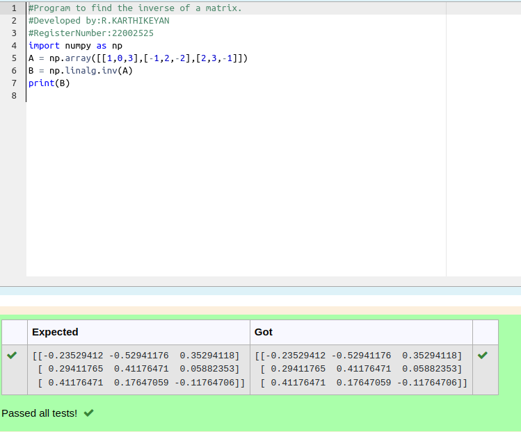

# INVERSE-OF-A-MATRIX
## Aim:
To write a python program to find the inverse of a matrix
## Equipment’s required:
1. 	Hardware – PCs
2. 	Anaconda – Python 3.7 Installation / Moodle-Code Runner
## Algorithm:
### Step1 : 
We have to initialise program using import numpy to perform mathematical calculation 
### Step 2: 
The input from the user is stored in the variable a
### Step 3: 
using the np.linalg.inv(A).We can find the inverse of the matrix.
### Step 4:
End of the program 

## Program:
```PYTHON
#Program to find the inverse of a matrix.
#Developed by:R.KARTHIKEYAN
#RegisterNumber:22002525
import numpy as np
A = np.array([[1,0,3],[-1,2,-2],[2,3,-1]])
B = np.linalg.inv(A)
print(B)


```
## Output:

## Result:
Thus the inverse of given matrix is successfully solved using python program

